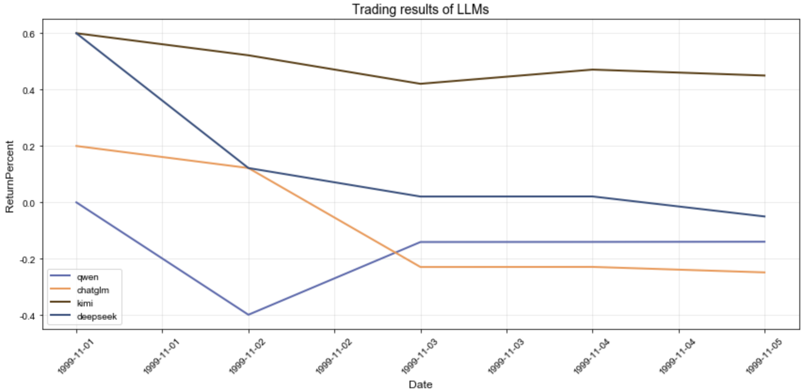

# ARIN7600: AlphaArena 模拟复刻

- main.py：运行主函数，debug=True 为取前 5 日进行模型
- plot_result.ipynb：将运行完的结果画图展示出来
- results：运行结果存储目录
- prompts：定义交易规则的 prompt
    - Part2：交易规则
    - Part3：输出示例
    - Part4：补充说明
- original_data：股票数据目录

> 单线程运行时间：平均 1min30s 跑一个交易日

##### 前 5 日运行 demo 结果

# Update 2025.11.03

**前端：**

- 首页：折线图，跟alphaarena 一样
- 四张卡片，每张显示大模型的每日选股策略

**待完善：**

- 历史记录保存，做 checkpoint

# Update 2025.11.01

- Pipline 搭建完毕，demo 运行成功

##### 待完善：

- 股票交易规则（优化+详细）
- 模型 prompt 改进（当前为仅输入前一天的股票信息，之后改为历史 5 天的 df 格式信息）
- 多线程运行（4 个 llm 请求 api 时采用多线程方法，运行速度理论提高 4 倍）